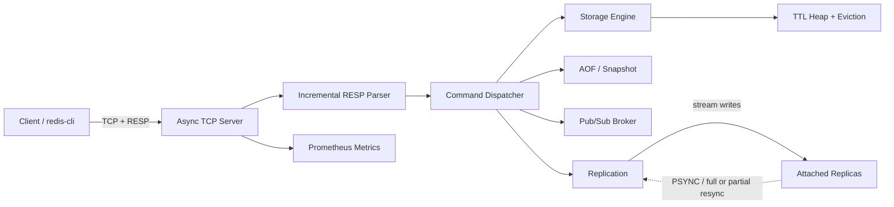
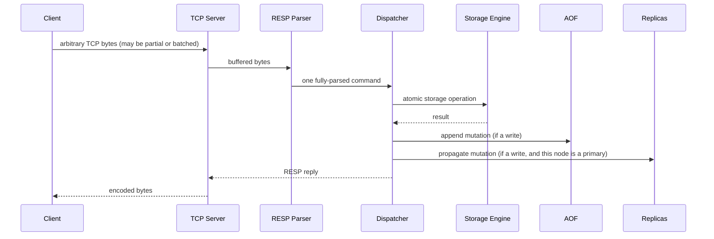
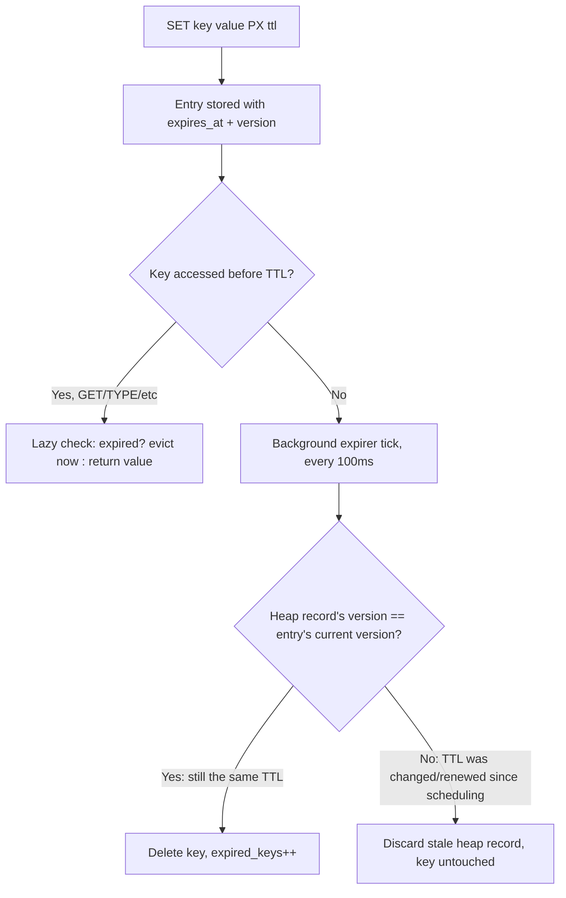
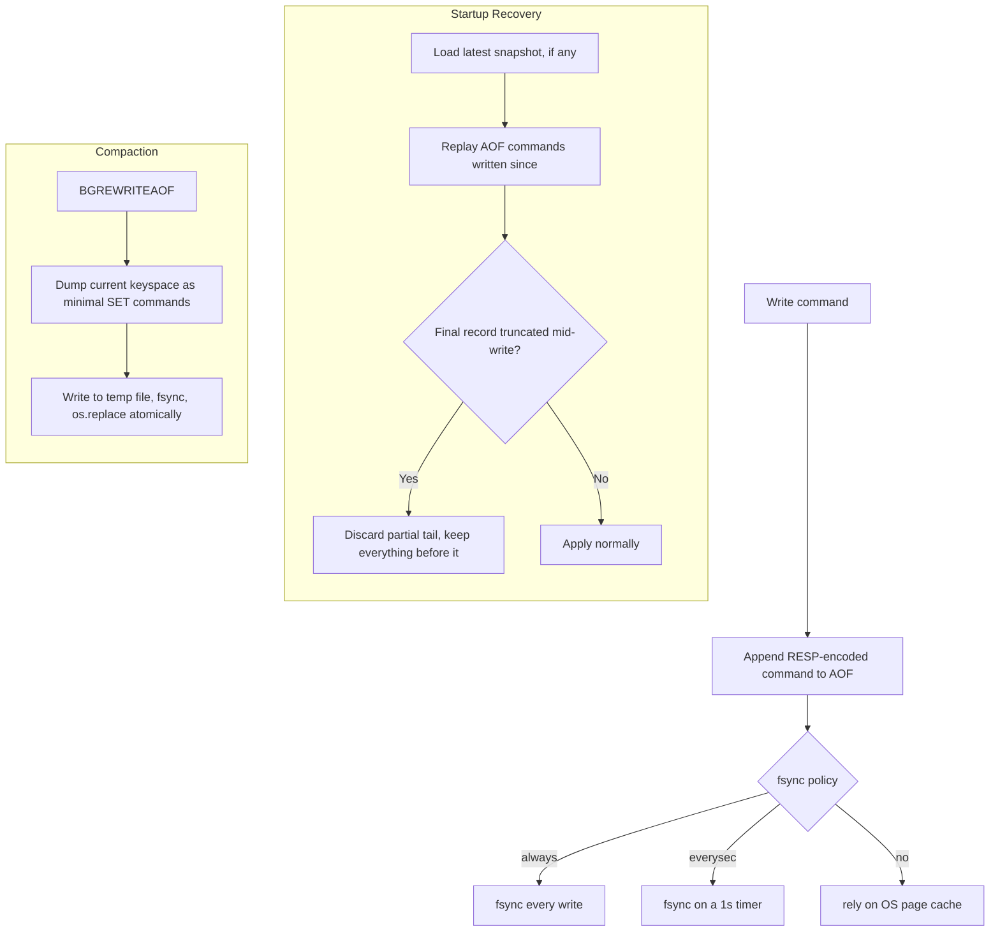
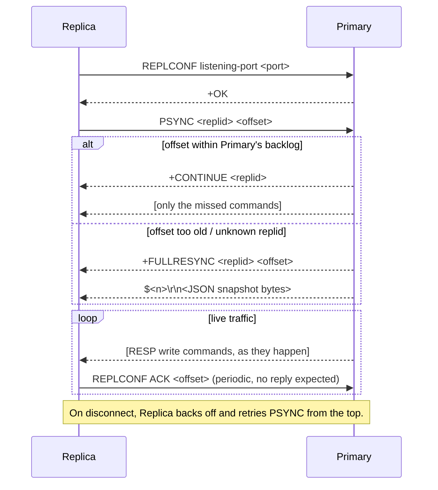

# MiniRedis

[](#quick-start) [](.github/workflows/ci.yml)

A Redis-inspired, RESP-compatible in-memory data store built from scratch in Python `asyncio` — no Redis dependency, no vendored C extension, no shortcuts on the hard parts. Single primary, optional read replicas, real crash-recoverable persistence, real concurrency control.

## Problem Statement

Most portfolio "build your own Redis" projects stop at a hash map behind a socket. That skips almost everything that makes an in-memory data store hard to build correctly:

- TCP gives you a byte stream, not messages — how do you parse commands that arrive fragmented or batched?
- Multiple clients touch the same keys concurrently — what actually guarantees a `GET` never observes a half-written `SET`?
- A process restart or crash shouldn't erase the dataset — but syncing to disk on every write is far too slow for a cache.
- A slow subscriber or a full memory budget shouldn't be allowed to degrade every other client.
- A single node is a single point of failure — how do you get a second copy of the data without inventing a distributed consensus protocol?

MiniRedis exists to answer each of those questions with working code, not slides. Every claim in this README is backed by a test in `tests/` and, where relevant, a runnable benchmark in `benchmarks/`.

## Why MiniRedis Was Built

As a portfolio project, the goal was never "reimplement Redis" — it's to demonstrate the systems-engineering judgment a backend/infrastructure interview actually probes: correct concurrency under a shared mutable data structure, durability trade-offs under different fsync policies, TTL scheduling that doesn't leak, backpressure that doesn't cascade, and primary-replica replication with a resync protocol you can draw on a whiteboard. See [`docs/interview-guide.md`](docs/interview-guide.md) for the question-by-question version of this.

## High-Level Architecture



Every arrow above is a real module boundary in `miniredis/` — protocol, server, commands, storage, persistence, pubsub, replication, observability — not just a diagram simplification. See [`docs/architecture.md`](docs/architecture.md) for concurrency and failure semantics in prose.

## Client Request Lifecycle



Nothing here assumes one `read()` equals one command, or that a write is "done" once it's applied in memory — durability (AOF) and replication both fire off the same event, so they can never silently disagree about which writes count.

## TTL Lifecycle



The version check in the right-hand branch is the one non-obvious design decision in the whole codebase — see `docs/design-decisions.md` and `tests/unit/test_ttl_heap_versioning.py` for exactly why a naive heap breaks without it.

## AOF Persistence and Recovery



## Primary to Replica Replication



## Supported Commands

`PING`, `ECHO`, `SET`, `GET`, `GETDEL`, `MGET`, `MSET`, `DEL`, `EXISTS`, `TYPE`, `INCR`, `DECR`, `INCRBY`, `DECRBY`, `EXPIRE`, `PEXPIRE`, `PEXPIREAT`, `TTL`, `PTTL`, `PERSIST`, `DBSIZE`, `FLUSHDB`, `KEYS`, `SCAN`, `INFO`, `COMMAND`, `SAVE`, `BGREWRITEAOF`, `MULTI`, `EXEC`, `DISCARD`, `SUBSCRIBE`, `UNSUBSCRIBE`, `PUBLISH`, `REPLCONF`, `PSYNC`, `REPLICAOF`.

`SET` supports `EX`, `PX`, `PXAT`, `NX`, and `XX` in valid combinations.

## RESP Protocol

Simple strings, errors, integers, bulk strings/null bulk strings, and arrays are encoded/decoded by an incremental parser that never assumes one TCP read equals one command — it's fed a growing buffer and either returns a parsed value or raises `NeedMoreData`. Oversized bulk strings/arrays/requests are rejected by configured limits. See [`docs/protocol.md`](docs/protocol.md).

## Storage Engine

Binary keys map to `Entry` objects holding the value, creation time, monotonic expiration, last access time, access count, a `version` counter, and an approximate memory size. All access goes through `Storage`, guarded by a single `asyncio.Lock` — nothing outside `storage/engine.py` ever touches the underlying dict directly, which is what makes every public method atomic with respect to every other one.

## Expiration

Reads perform lazy expiration (check-and-evict on access). A background task also actively sweeps a min-heap of `(expires_at, version, key)` records every 100ms. The `version` field is what makes stale heap records harmless after a TTL is changed or a key is overwritten — see the TTL Lifecycle diagram above and `docs/design-decisions.md`.

## Eviction Policies

`noeviction`, `allkeys-lru`, and `allkeys-lfu` are supported. Memory accounting sums key/value bytes plus a fixed per-entry overhead estimate — good enough for *relative* eviction decisions, deliberately not claimed as exact process RSS.

## Persistence

AOF supports `always`, `everysec`, and `no` fsync policies — see the durability trade-off table below. Mutations are RESP-encoded; TTLs are persisted as absolute (`PXAT`) timestamps so replay/recovery doesn't reset the clock. A crash-truncated final AOF record is discarded safely; corruption inside an otherwise-complete record fails recovery loudly rather than silently dropping data. `BGREWRITEAOF` compacts the log to the minimal commands needed to reconstruct current state, swapped in atomically via temp-file-plus-rename. Snapshots use the same atomic-swap pattern. See [`docs/persistence.md`](docs/persistence.md).

| fsync policy | Durability | Throughput | Data loss window on crash |
|---|---|---|---|
| `always` | Strongest | Lowest (fsync every write) | None — every acknowledged write is on disk |
| `everysec` | Balanced (default) | High | Up to ~1 second of writes |
| `no` | Weakest | Highest | Whatever the OS hadn't flushed yet — can exceed 1s |

## Replication

Single primary, N read replicas, asynchronous. A replica attaches via `REPLCONF` + `PSYNC`, gets either a full resync (JSON snapshot of the entire keyspace) or a partial resync (just the missed commands, if they're still in the primary's backlog), then streams live writes forever. Writes are rejected on a replica unless they arrive over its own master link (`READONLY` error to ordinary clients). Reconnect is a fixed-delay retry loop — deliberately simple, not exponential backoff with jitter, favoring whiteboard-explainability over production polish here. See `miniredis/replication/` and `tests/replication/test_replication.py`.

**What this is not:** there's no automatic failover, no quorum, no multi-primary writes, and no chained replication (a replica never re-propagates to its own downstream). Promoting a replica to primary is a manual `REPLICAOF NO ONE`.

## Concurrency Model

Every `Storage` method is atomic thanks to a single `asyncio.Lock`. Ordinary commands run concurrently with each other (they're "readers" of an execution gate); `EXEC` takes that gate exclusively so a transaction's queued commands can never be interleaved with another connection's commands mid-batch — a *stronger* guarantee than per-operation atomicity, and a different one on purpose. See `miniredis/server/lifecycle.py` and `tests/unit/test_transactions.py`.

## Transactions

`MULTI` queues commands, `DISCARD` clears them, `EXEC` runs the queue under the exclusive gate above. `WATCH`/optimistic locking is intentionally not implemented — documented as a limitation, not silently missing.

## Pub/Sub

The broker maintains channel-to-subscriber and connection-to-channel indexes. Each connection has a bounded delivery queue; publishing is non-blocking (`put_nowait`), so a slow subscriber drops messages instead of applying backpressure to the publisher or every other subscriber.

## Observability

Prometheus exports: command count/latency by command and status, connected clients/total connections, key count, memory/peak memory, expired/evicted keys, protocol errors, AOF writes/rewrites/size, GET hit/miss counts, and replication offset/connected-replica-count/lag. `INFO` mirrors the same data in Redis's `# Section` / `key:value` text format. Logs are JSON-structured. Grafana provisioning is included. See [`monitoring/`](monitoring/).

## Quick Start

```bash
git clone <repository-url>
cd miniredis-final
python -m venv .venv
source .venv/bin/activate
pip install -e ".[dev]"
python -m miniredis
```

Then, in another terminal:
```bash
redis-cli -p 6379 PING
redis-cli -p 6379 SET user:1 alice EX 60
redis-cli -p 6379 GET user:1
redis-cli -p 6379 INCR visits
```

### Running a replica

```bash
# terminal 1: primary on the default port
python -m miniredis

# terminal 2: replica, following the primary
MINIREDIS_PORT=6380 REPLICA_OF=127.0.0.1:6379 python -m miniredis

# terminal 3
redis-cli -p 6379 SET k v
redis-cli -p 6380 GET k        # -> "v", replicated
redis-cli -p 6380 SET k v2     # -> (error) READONLY ...
```

## Docker

```bash
docker compose up --build
redis-cli -h localhost -p 6379 PING
```
Services: MiniRedis `6379`, metrics `9121`, Prometheus `9090`, Grafana `3000`. `redis-reference` (for benchmark comparison) is available under the `benchmark` profile only.

## Configuration

Copy `.env.example`. Key controls: host/port, connection/request limits, memory/eviction policy, AOF path/fsync policy, snapshot path, `replica_of` (host:port to follow), replication backlog/ack/reconnect tuning, metrics, and log level. Full list in `miniredis/config/settings.py`.

## Testing Strategy

```bash
make test         # everything
make lint         # ruff
make format-check # black --check
make typecheck    # mypy
```

Coverage by layer:
- **Protocol**: fragmentation, pipelining, malformed input, property-based round-tripping (Hypothesis).
- **Storage**: TTL versioning correctness (the stale-heap-record scenario, proven not just asserted), eviction policies, memory accounting.
- **Concurrency**: racing GET/SET, TTL expiring under concurrent access, transaction atomicity across 40+ concurrent connections, slow Pub/Sub subscriber isolation, 100-client/10k-op counter correctness over real TCP.
- **Persistence**: crash-tail truncation, snapshot atomicity, AOF rewrite correctness (including a real process restart against a rewritten file).
- **Replication**: SET/DELETE/TTL propagation, sequential and concurrent writes, ordering via offset, disconnect/reconnect, read-only enforcement — all over real TCP sockets between two live `MiniRedisServer` instances, not mocks.

## Benchmark Methodology

`benchmarks/suite.py` measures GET throughput, SET throughput, an 80%-read/20%-write mixed workload, and pipelined throughput, at several concurrency levels you choose. It reports ops/sec, p50/p95/p99 latency, and server-reported memory (via `INFO`), and writes machine-readable JSON + CSV to `benchmarks/results/` (gitignored — regenerate on your own machine, don't trust numbers from someone else's laptop).

```bash
python -m miniredis &
python benchmarks/suite.py --port 6379 --requests 3000 --concurrency 1 10 50
```

Optionally compare against a real Redis running alongside (`docker compose --profile benchmark up redis-reference`, then `--compare-port 6380`) — this never asserts MiniRedis matches or beats Redis, it just prints both measurements side by side.

## Performance Results

No numbers are hard-coded here — they'd be stale, machine-dependent, and dishonest as a portfolio claim. Run `benchmarks/suite.py` yourself and cite the JSON/CSV it produces, including your CPU, Python version, and OS, if you reference results anywhere (a resume, an interview, a blog post).

## Design Decisions

See [`docs/design-decisions.md`](docs/design-decisions.md): TTL versioning, approximate memory accounting, the execution-gate vs. per-op-lock trade-off, replication's full/partial resync choice, and more — each pointing at the test that proves the claim.

## Limitations

Single writer per keyspace (no multi-primary), no automatic failover or quorum, no chained replication, no sharding/consistent hashing, no Raft/Paxos, no ACL/TLS, no Lua scripting, no `WATCH`, and only the string data type (no hashes/lists/sets/sorted sets/streams). Eviction sampling is simpler than Redis's. This is a learning/portfolio project, not a production cache — do not expose it directly to the untrusted internet.

## Future Improvements (Explicitly Out of Scope Here)

If asked "how would this scale further" in an interview, these are the honest next steps — deliberately not implemented, to keep this project's core understandable and defensible:
- Consistent-hash sharding across multiple primaries
- Raft/Paxos-based automatic failover and leader election
- Multi-region / cross-datacenter replication topologies
- Additional data types (hashes, lists, sets, sorted sets)
- TLS and ACL-based auth

## Project Structure

```
miniredis/
  protocol/       RESP encode/decode, incremental parser
  server/         TCP listener, connection state, execution gate
  commands/       per-command handlers + dispatch table
  storage/        keyspace engine, TTL heap, eviction, memory accounting
  persistence/    AOF (+ rewrite), snapshots
  replication/    primary-side streaming, replica-side sync client
  pubsub/         channel broker with bounded per-connection queues
  observability/  Prometheus metrics, structured logging
  config/         Settings (env-driven)
tests/            unit, protocol, integration, persistence, replication
benchmarks/       suite.py + shared RESP client
scripts/          smoke_test.py
docs/             architecture, protocol, persistence, design-decisions, interview-guide, benchmarks
monitoring/       Prometheus + Grafana provisioning
```

## Interview Preparation

[`docs/interview-guide.md`](docs/interview-guide.md) has ~25 questions with answers grounded in this actual implementation (not generic Redis trivia) — TCP framing, RESP parsing, TTL heap versioning, atomicity, transactions, Pub/Sub backpressure, AOF/snapshot recovery, replication offsets and resync, CAP-related trade-offs, and where the real bottlenecks are.

## License

MIT. See [`LICENSE`](LICENSE).
