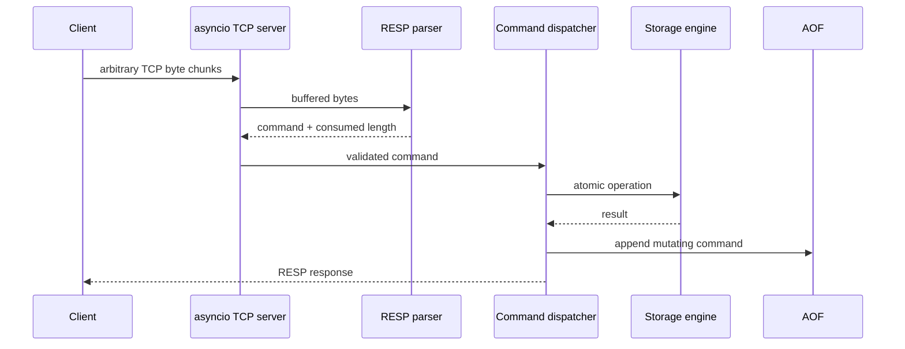

# MiniRedis Architecture

## Problem, goals, non-goals
MiniRedis is an educational Redis-compatible cache/database, single-writer with optional asynchronous read replicas, that demonstrates TCP framing, RESP, atomic command execution, TTL, eviction, persistence (including AOF rewrite), transactions, Pub/Sub, replication, and observability. It is not a drop-in replacement for every Redis data type, Redis Cluster, ACLs, Lua, automatic failover/consensus, or hostile public-Internet exposure.

## Request path

## Networking and protocol
`asyncio.start_server` creates one task per connection. TCP is treated as a byte stream: the parser returns `NeedMoreData` for incomplete frames, supports multiple commands per buffer, binary bulk strings, request limits and malformed-frame errors. Connection count, idle timeout and bounded Pub/Sub queues provide backpressure controls.

## Storage and concurrency
The keyspace maps binary keys to entries containing value, creation time, optional monotonic expiry, last access, frequency, and a version counter. Storage mutations use short `asyncio.Lock` critical sections. Normal commands may execute concurrently across client tasks; each storage operation uses a short critical section to preserve command atomicity. An execution gate allows concurrent normal commands but gives `EXEC` an exclusive window, so a transaction queue cannot be interleaved by another client. Networking and subscriber delivery remain concurrent.

## Expiration
Lazy expiration occurs on access. Active expiration uses a min-heap of `(expires_at, version, key)`. Updating or removing a TTL bumps the entry's version; the heap record's captured version is checked against the key's live version before deleting, making old heap nodes harmless instead of requiring an O(n) heap search to remove them.

## Memory and eviction
Approximate accounting includes key/value bytes and a documented metadata estimate; Python allocator/object overhead means this is not RSS. `noeviction`, `allkeys-lru`, and `allkeys-lfu` are implemented. These policies are intentionally simpler than Redis's sampled/approximated algorithms.

## Persistence and recovery
AOF stores RESP mutating commands with `always`, `everysec`, or `no` fsync policy. A truncated final frame is ignored as a crash tail; malformed complete content raises corruption. Snapshots use base64 for binary safety, wall-clock expiry metadata, fsync of a temporary file and atomic rename. SAVE/graceful snapshot rotates the AOF so startup can load snapshot then replay only subsequent commands. `BGREWRITEAOF` compacts the AOF itself the same way — dump current state as minimal SET commands, write to a temp file, atomically swap it in.

## Replication
A node is either a `primary` (default) or a `replica` (via `REPLICA_OF=host:port` at startup, or `REPLICAOF` at runtime). Replicas attach via `REPLCONF`+`PSYNC`, receive a full (JSON snapshot) or partial (backlog-covered) resync, then have every subsequent write streamed to them over the same connection — using the same bounded-queue/dedicated-pusher-task pattern as Pub/Sub delivery. Writes are propagated at exactly the same point a command is appended to the AOF (`MiniRedisServer.persist`), so AOF durability and replication can never disagree about which writes "count." A replica rejects writes from ordinary clients (`READONLY`) and reconnects with a fixed-delay retry loop on link loss. See `miniredis/replication/` and the sequence diagram in the README.

## Pub/Sub
The broker indexes channel→connections and connection→channels. Each connection has a bounded queue. A full queue drops delivery to that slow subscriber rather than blocking the publisher or growing memory without bound. Disconnect cleanup removes subscriptions.

## Observability and failure handling
Prometheus exposes command count/latency, connections, keys, memory, expiration, eviction, protocol errors, AOF writes and Pub/Sub publishes. Logs are structured JSON. Malformed clients are isolated; SIGINT/SIGTERM stops acceptance, marks unready, snapshots if enabled, flushes AOF, closes clients/background tasks and exits.

## Security and limitations
Payload/array/connection limits and safe JSON snapshots reduce obvious abuse. There is no TLS, ACL system, cluster consensus, automatic failover, scripting, streams, hashes, sets, sorted sets, or exact Redis memory accounting. Replication is single-primary/asynchronous only — no quorum, no multi-primary, no chained replicas. Deploy behind trusted infrastructure only.

## Future work
Consistent-hash routing and sharding across multiple primaries, Raft/Paxos-based automatic failover and leader election, synchronous replication with quorum acknowledgment, cluster membership, TLS/ACLs, more Redis data types, and parser profiling are natural extensions — deliberately left out to keep the current implementation whiteboard-explainable.
